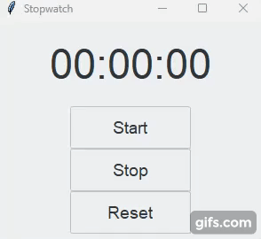

# Simple Stopwatch

Simple Stopwatch App using tkinter and ttkthemes.

App was made following [this](https://www.youtube.com/watch?v=QBYUws70A7M&ab_channel=AlinaChudnova) tutorial made by youtuber Alina Chudnova, however some changes were made due to the contents of it being a little outdated in regards to the interactions between ttkthemes and tkinter widgets.

### Features

- Start timer
- Stop timer
- Reset timer

## Demo

## Requirements
- Python 3+
- ttkthemes

## Usage

1. Run 'python stopwatch.py'